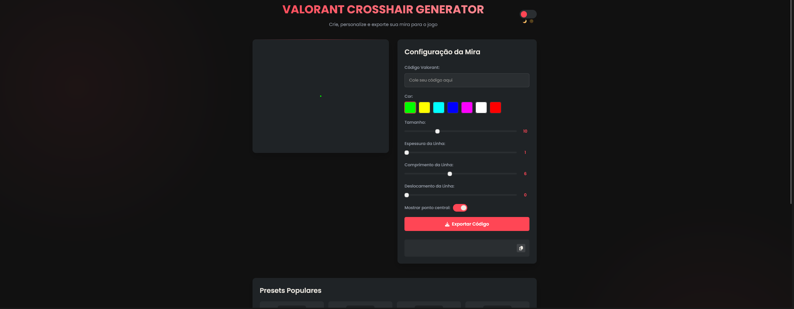

# Valorant Crosshair Generator

A custom crosshair generator for Valorant that allows you to create, preview, and export crosshair settings directly to the game.

## 📸 Screenshot



## 🎯 Features

- Intuitive and responsive interface
- Real-time preview of changes
- Complete crosshair customization:
  - Size
  - Line thickness
  - Line length
  - Offset
  - Center dot
  - Custom colors
- Valorant code export
- Popular presets
- Light/dark mode
- Modern and minimalist design

## 🚀 How to Use

1. Clone the repository:
```bash
git clone https://github.com/caiolul/valorant-crosshair.git
```

2. Run the project:
   - Using Docker:
   ```bash
   docker-compose up
   ```
   - Or open the `index.html` file directly in your browser

3. Customize your crosshair using the available controls
4. Copy the generated code
5. Paste the code in Valorant game

## 🛠️ Technologies Used

- HTML5
- CSS3
- JavaScript
- Docker
- Font Awesome
- Google Fonts (Poppins)

## 📦 Project Structure

```
valorant-crosshair/
├── index.html          # Main interface
├── style.css          # Application styles
├── script.js          # Application logic
├── Dockerfile         # Docker configuration
└── docker-compose.yml # Docker environment setup
```

## 🤝 Contributing

Contributions are always welcome! Feel free to open issues or send pull requests.

## 📝 License

This project is under the MIT License. See the [LICENSE](LICENSE) file for more details.

## ⚠️ Legal Notice

This project is not affiliated, associated, authorized, endorsed by, or in any way officially connected with Riot Games, or any of its subsidiaries or affiliates.
